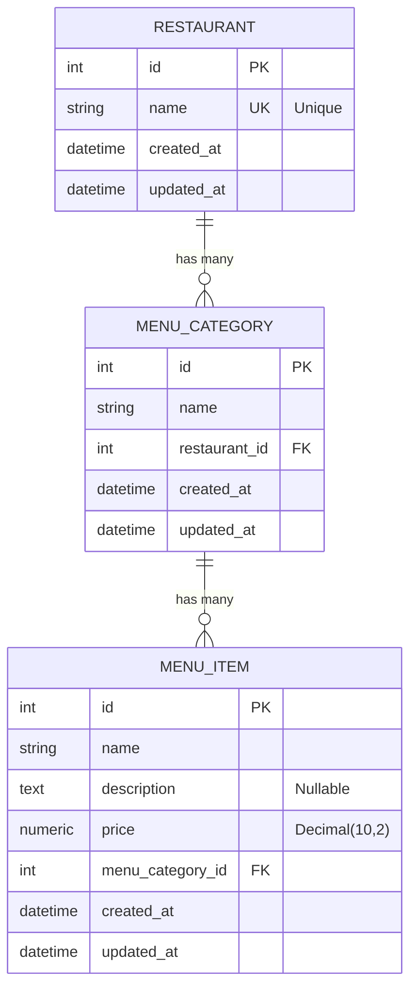

# Database Relationship Diagram

## Entity Relationship Diagram



## Visual ASCII Diagram

```
┌─────────────────────────────────────────┐
│            RESTAURANT                   │
│  ─────────────────────────────────────  │
│  Primary Key:                           │
│    • id (Integer, Auto-increment)      │
│                                         │
│  Attributes:                            │
│    • name (String, Unique)             │
│    • created_at (DateTime)             │
│    • updated_at (DateTime)             │
│                                         │
│  Relationships:                         │
│    └─→ categories (One-to-Many)        │
│        cascade: all, delete-orphan     │
└──────────────┬──────────────────────────┘
               │
               │ 1:N Relationship
               │ restaurant.categories
               │
               ▼
┌─────────────────────────────────────────┐
│         MENU_CATEGORY                   │
│  ─────────────────────────────────────  │
│  Primary Key:                           │
│    • id (Integer, Auto-increment)      │
│                                         │
│  Foreign Keys:                          │
│    • restaurant_id → restaurants.id    │
│                                         │
│  Attributes:                            │
│    • name (String)                     │
│    • created_at (DateTime)             │
│    • updated_at (DateTime)             │
│                                         │
│  Relationships:                         │
│    ├─→ restaurant (Many-to-One)        │
│    └─→ menu_items (One-to-Many)        │
│        cascade: all, delete-orphan     │
└──────────────┬──────────────────────────┘
               │
               │ 1:N Relationship
               │ menu_category.menu_items
               │
               ▼
┌─────────────────────────────────────────┐
│            MENU_ITEM                    │
│  ─────────────────────────────────────  │
│  Primary Key:                           │
│    • id (Integer, Auto-increment)      │
│                                         │
│  Foreign Keys:                          │
│    • menu_category_id →                │
│      menu_categories.id                │
│                                         │
│  Attributes:                            │
│    • name (String)                     │
│    • description (Text, Nullable)      │
│    • price (Numeric 10,2)              │
│    • created_at (DateTime)             │
│    • updated_at (DateTime)             │
│                                         │
│  Relationships:                         │
│    └─→ menu_category (Many-to-One)     │
└─────────────────────────────────────────┘
```

## Relationship Details

### 1. Restaurant ↔ MenuCategory
- **Type**: One-to-Many (1:N)
- **Restaurant Side**: 
  - Attribute: `categories` (relationship)
  - Type: List of MenuCategory objects
  - Cascade: `all, delete-orphan` (deletes categories when restaurant is deleted)
  
- **MenuCategory Side**:
  - Foreign Key: `restaurant_id` → `restaurants.id`
  - Attribute: `restaurant` (relationship)
  - Type: Single Restaurant object

**Example**:
```python
restaurant = Restaurant(name="Pizza Palace")
category1 = MenuCategory(name="Pizza", restaurant_id=restaurant.id)
category2 = MenuCategory(name="Appetizers", restaurant_id=restaurant.id)
# restaurant.categories → [category1, category2]
# category1.restaurant → restaurant
```

### 2. MenuCategory ↔ MenuItem
- **Type**: One-to-Many (1:N)
- **MenuCategory Side**:
  - Attribute: `menu_items` (relationship)
  - Type: List of MenuItem objects
  - Cascade: `all, delete-orphan` (deletes items when category is deleted)
  
- **MenuItem Side**:
  - Foreign Key: `menu_category_id` → `menu_categories.id`
  - Attribute: `menu_category` (relationship)
  - Type: Single MenuCategory object

**Example**:
```python
category = MenuCategory(name="Pizza", restaurant_id=1)
item1 = MenuItem(name="Margherita", price=12.99, menu_category_id=category.id)
item2 = MenuItem(name="Pepperoni", price=14.99, menu_category_id=category.id)
# category.menu_items → [item1, item2]
# item1.menu_category → category
```

## Complete Data Flow

```
Restaurant (1)
    │
    ├── MenuCategory (Many)
    │       │
    │       └── MenuItem (Many)
    │
    └── MenuCategory (Many)
            │
            └── MenuItem (Many)
```

## Real-World Example

```
┌─────────────────────────────────────────┐
│ Restaurant: "Pizza Palace" (id: 1)     │
└─────────────────────────────────────────┘
              │
              ├─────────────────────────────┐
              │                             │
              ▼                             ▼
┌──────────────────────────┐  ┌──────────────────────────┐
│ MenuCategory: "Pizza"    │  │ MenuCategory: "Desserts" │
│ (id: 1, restaurant_id:1) │  │ (id: 2, restaurant_id:1) │
└──────────────────────────┘  └──────────────────────────┘
       │                                │
       ├─────────────┬                  ├─────────────┬
       │             │                  │             │
       ▼             ▼                  ▼             ▼
┌─────────────┐ ┌─────────────┐ ┌─────────────┐ ┌─────────────┐
│ MenuItem:   │ │ MenuItem:   │ │ MenuItem:   │ │ MenuItem:   │
│ Margherita  │ │ Pepperoni   │ │ Tiramisu    │ │ Cake        │
│ $12.99      │ │ $14.99      │ │ $8.99       │ │ $7.99       │
│ (cat_id:1)  │ │ (cat_id:1)  │ │ (cat_id:2)  │ │ (cat_id:2)  │
└─────────────┘ └─────────────┘ └─────────────┘ └─────────────┘
```

## SQLAlchemy Relationship Code

```python
# Restaurant Model
class Restaurant(Base):
    categories = relationship(
        'MenuCategory', 
        back_populates='restaurant', 
        cascade='all, delete-orphan'
    )

# MenuCategory Model
class MenuCategory(Base):
    restaurant_id = Column(Integer, ForeignKey('restaurants.id'))
    
    restaurant = relationship('Restaurant', back_populates='categories')
    menu_items = relationship(
        'MenuItem', 
        back_populates='menu_category', 
        cascade='all, delete-orphan'
    )

# MenuItem Model
class MenuItem(Base):
    menu_category_id = Column(Integer, ForeignKey('menu_categories.id'))
    
    menu_category = relationship('MenuCategory', back_populates='menu_items')
```

## Cascade Delete Behavior

```
Delete Restaurant
    └─→ Deletes all MenuCategories (cascade)
        └─→ Deletes all MenuItems (cascade)

Delete MenuCategory
    └─→ Deletes all MenuItems (cascade)
    └─→ Restaurant remains (no cascade up)

Delete MenuItem
    └─→ No cascade (leaf node)
```

## Access Patterns

### From Restaurant to Items
```python
restaurant = db.query(Restaurant).first()
for category in restaurant.categories:
    for item in category.menu_items:
        print(f"{item.name}: ${item.price}")
```

### From Item to Restaurant
```python
item = db.query(MenuItem).first()
category = item.menu_category
restaurant = category.restaurant
print(f"{item.name} belongs to {restaurant.name}")
```

### Direct Query with Joins
```python
# Get all items for a restaurant
items = db.query(MenuItem)\
    .join(MenuCategory)\
    .filter(MenuCategory.restaurant_id == restaurant_id)\
    .all()
```

